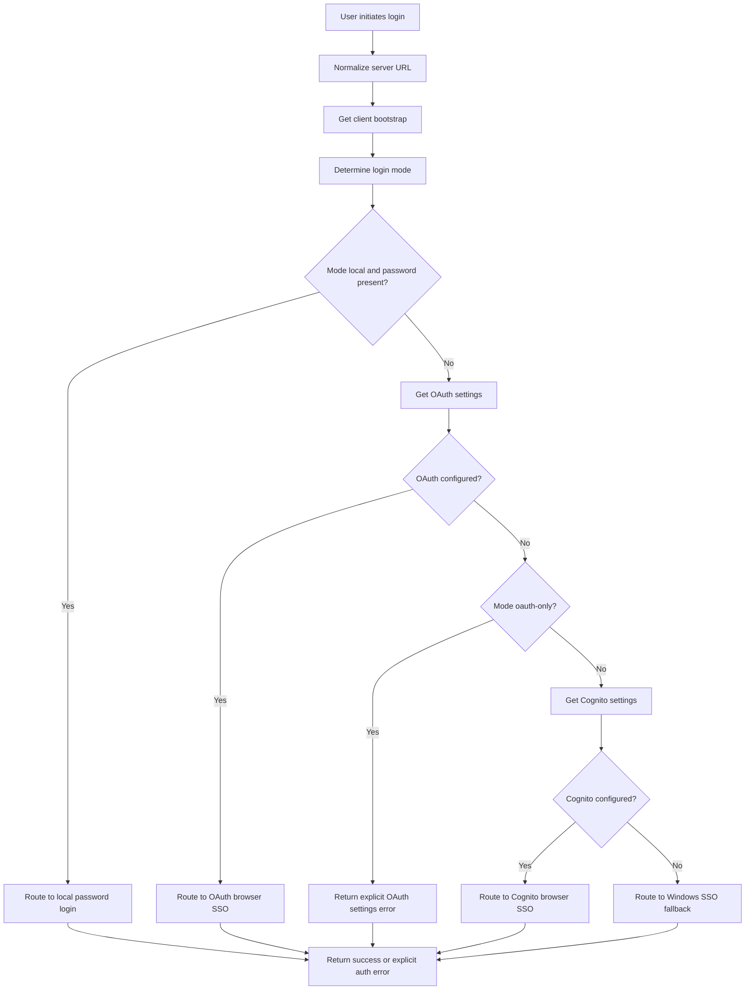

# UF-US-AUTH-001: Adaptive Login Mode Routing

- Story reference: US-AUTH-001
- FR reference: FR-015
- Status: Backfilled from implementation
- Last updated: 2026-06-29

## Goal
Route each login attempt to the correct authentication path automatically based on server configuration and available credentials.

## Actors
- Operator (CLI or Client user)
- Adept Power Tools auth service
- Adept server options endpoints
- External IdP (OAuth/Cognito) when applicable

## Preconditions
- User provides server URL and username.
- Server URL is reachable or an error path is produced.

## Trigger
- User initiates login.

## Primary Flow (User Perspective)
1. User initiates login.
2. System determines the appropriate login method.
3. User is guided through the correct login experience:
   - Password login
   - Company SSO (browser)
   - Windows login
4. User completes login successfully.
5. User receives confirmation or a clear error message if login fails.

## System Routing Flow (Implementation Detail)
1. System normalizes the server URL to base path format.
2. System requests client bootstrap settings from the server.
3. System determines login mode using LoginMode and fallback flags.
4. System normalizes azure, azuread, and entra aliases to oauth.
5. If login mode is local and a password is provided, system routes to local password login.
6. Otherwise, system attempts OAuth settings discovery.
7. If OAuth is configured, system routes to browser SSO flow.
8. If OAuth is not configured and mode is not oauth-only, system attempts Cognito settings discovery.
9. If Cognito settings are configured, system routes to browser SSO flow with Cognito callback policy.
10. If neither OAuth nor Cognito is configured, system routes to Windows SSO fallback.
11. System returns success or error outcome with user-facing message.

## Alternate and Exception Flows

### A1: OAuth-Only Mode but Settings Unavailable
1. Server indicates oauth mode.
2. OAuthSettings endpoint is unavailable or incomplete.
3. System does not fall through to Cognito or Windows fallback.
4. System returns explicit error: OAuth is configured but settings could not be retrieved.

### A2: Browser Callback Listener Cannot Start
1. Selected route is browser SSO.
2. Local callback listener cannot bind to required port range.
3. System returns explicit callback listener port-in-use error.

### A3: Redirect URI Preflight Rejection (OAuth preflight path)
1. Selected route is OAuth browser SSO (non-Cognito preflight path).
2. Preflight detects redirect_mismatch or invalid_redirect_uri.
3. System returns actionable message indicating localhost callback URL requirement.

### A4: Bootstrap Request Fails
1. Bootstrap endpoint request fails.
2. System continues with settings-based detection and fallback logic.
3. System still routes to OAuth, Cognito, or Windows based on available configuration.

## Postconditions
- Exactly one auth path is selected per login attempt:
  - Local password login
  - OAuth browser SSO
  - Cognito browser SSO
  - Windows SSO fallback
- Operator receives either authenticated result or explicit error message.

## Acceptance Mapping
- AC1: HTTP auth checks server options and bootstrap to determine mode.
  - Covered by Primary Flow steps 2-4 and A4.
- AC2: Flow routes among local password, OAuth/Cognito browser SSO, and Windows SSO fallback.
  - Covered by Primary Flow steps 5-10.
- AC3: Unsupported or incomplete settings return explicit errors.
  - Covered by A1, A2, and A3.

## Flow Diagram

## Implementation Notes
- Routing logic is implemented in src/AdeptTools.Backend.Http/Auth/HttpAdeptAuthService.cs.
- OAuth alias normalization includes azure, azuread, and entra mapped to oauth.
- OAuth-only mode explicitly blocks fallback to Cognito or Windows login when OAuth settings are unavailable.
