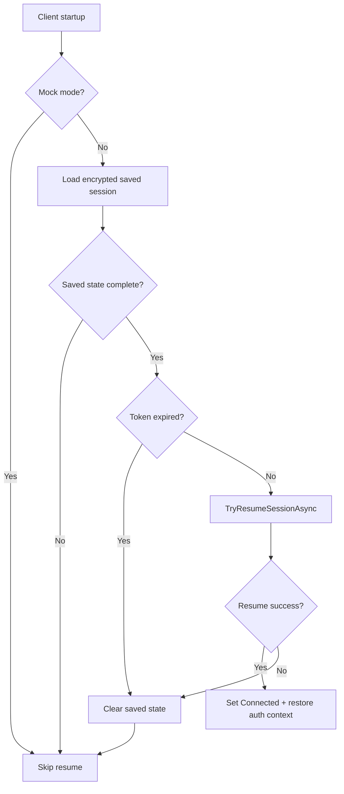

# UF-US-AUTH-006: Secure Session Resume on Startup

- Story reference: US-AUTH-006
- FR references: FR-021, FR-022
- Surface: GUI (Client)
- Status: Backfilled from implementation
- Last updated: 2026-06-29

## Goal
Allow users to reconnect automatically when possible, reducing repeated logins while ensuring expired or invalid sessions are handled safely.

## User Flow (Primary)

1. User opens the application.
2. If a previous session exists, the system attempts to reconnect automatically.
3. If the session is still valid, the user is connected without needing to log in again.
4. If the session is no longer valid, the user is prompted to log in.

## System Session Resume Flow (Detailed)
1. Application startup initializes connection state.
2. If not mock mode, client reads encrypted HTTP session state.
3. Client verifies required state fields (server URL and token).
4. Client checks token expiry using stored metadata or token claim.
5. If token appears valid, client enters "Resuming session..." status and calls resume API path.
6. If resume succeeds, client sets Connected state and restores API auth context.

## Alternate Flows

### A1: Missing or Incomplete Saved State
1. No valid persisted state is found.
2. Client remains in normal disconnected connect flow.

### A2: Expired Token
1. Expiry check fails.
2. Client clears saved auth state and remains disconnected.

### A3: Resume Validation Failure
1. Resume path fails remote refresh/session check.
2. Client logs out/clears state and resets to disconnected.

### A4: Resume Exception
1. Resume throws exception.
2. Client clears saved state and resets status safely.

## Postconditions
- Valid sessions are resumed silently.
- Invalid sessions self-heal by clearing persisted auth and requiring reconnect.

## Flow Diagram

## User Experience Notes
- Successful session resume should feel seamless and require no user action.
- Users should only be prompted to log in when necessary.
- Any failure should result in a clean, understandable return to the login state.
``