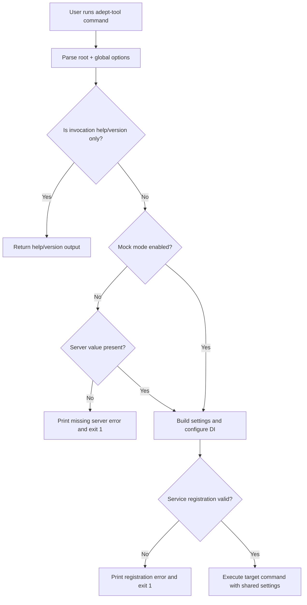

# UF-US-CLI-001: Global Runtime Options

- Story reference: US-CLI-001
- FR references: FR-001, FR-002, FR-003
- Status: Backfilled from implementation
- Last updated: 2026-06-29

## Goal
Allow users to provide command settings once and have them applied consistently, reducing repetition and preventing configuration errors.

## Actors
- CLI operator
- CLI parser and middleware
- DI service registration
- Command handlers (auth, workflow, import)

## Preconditions
- Operator invokes adept-tool with a command or help/version option.

## Trigger
- User runs a CLI invocation.

## User Flow (Primary)

1. User runs a command with optional global options (server, user, backend, etc.).
2. The system applies the provided options to the command.
3. If required inputs are missing (e.g., server in non-mock mode), the user receives a clear error.
4. If inputs are valid, the command runs using the provided settings.
5. The command completes with output or error results.

## System Execution Flow (Detailed)

1. User invokes root command with optional global options and a subcommand.
2. Parser reads global options:
   - --server (-s)
   - --user (-u)
   - --mock (-m)
   - --backend (-b)
   - --verbose (-v)
   - --log
3. Parser applies global options to the selected command path.
4. Middleware validates that non-mock command execution includes a server value.
5. Middleware builds runtime settings object from parsed global options.
6. Middleware configures DI services using backend and mode.
7. Middleware registers the service provider into binding context.
8. Target command executes using shared settings and registered services.

## Alternate and Exception Flows

### A1: Missing Server in Non-Mock Mode
1. User executes a command without --mock and without --server.
2. Middleware detects invalid combination.
3. CLI prints: Error: --server is required unless --mock is specified.
4. CLI exits with code 1.

### A2: HTTP Backend Configuration Without Server
1. User route resolves to HTTP backend without a usable server value.
2. Service registration throws invalid operation exception.
3. Middleware prints the exception message as CLI error.
4. CLI exits with code 1.

### A3: Help or Version Invocation
1. User runs root-level help/version behavior.
2. Server requirement enforcement is bypassed for non-operational invocations.
3. CLI returns help/version output without server validation failure.

## Postconditions
- Global options are available to all command groups.
- Commands execute with a consistently built runtime settings object.
- Invalid non-mock invocations fail early with explicit error output.

## Acceptance Mapping
- AC1: CLI accepts global options for server URL, username, backend type, mock mode, verbose output, and log path.
  - Covered by Primary Flow steps 2 and 5.
- AC2: Global options are available across command groups.
  - Covered by Primary Flow steps 3 and 8.
- AC3: Non-mock execution without server input fails with a clear error.
  - Covered by Alternate Flows A1 and A2.

## Flow Diagram

## Implementation Notes
- Global options and middleware validation are implemented in src/AdeptTools.Cli/Program.cs.
- Backend-specific service registration and HTTP server requirement are implemented in src/AdeptTools.Cli/Infrastructure/ServiceRegistration.cs.
- Command groups consuming global runtime context are defined in:
  - src/AdeptTools.Cli/Commands/AuthCommands.cs
  - src/AdeptTools.Cli/Commands/WorkflowCommands.cs
  - src/AdeptTools.Cli/Commands/ImportCommands.cs

## User Experience Notes
- Users should not need to repeat common options across commands
- Errors should be immediate and clearly explain what is missing
- Command behavior should feel consistent regardless of command group
- Verbose and logging options should help diagnose issues when needed
