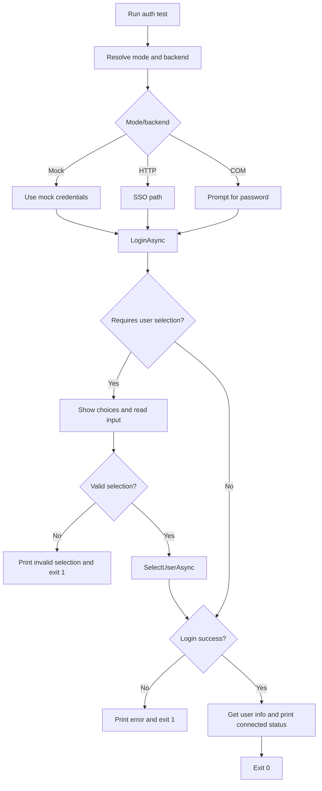

# UF-US-CLI-002: Authentication Smoke Test

- Story reference: US-CLI-002
- FR reference: FR-004
- Status: Backfilled from implementation
- Last updated: 2026-06-29

## Goal
Allow operators to quickly validate authentication and connectivity for the selected backend and receive clear success/failure output.

## User Flow (Primary)

1. User runs `auth test` with optional runtime options.
2. The command determines the appropriate login method based on the environment:
   - Mock mode uses simulated credentials
   - HTTP uses browser-based company login (SSO)
   - COM uses username and password
3. If multiple accounts are detected, the user is prompted to select one.
4. If login succeeds, the system displays connection details (user, server, version).
5. The command exits successfully.

## System Authentication Execution Flow (Detailed)
1. User runs `auth test` with global runtime options.
2. CLI resolves server display and backend/mode context.
3. CLI determines credential path:
   - Mock mode: use mock credentials.
   - HTTP backend: SSO path with username and browser-based auth.
   - COM backend: username plus prompted password.
4. CLI calls `LoginAsync` on the resolved auth service.
5. If login requires user selection, CLI displays choices and collects a selection.
6. CLI completes selection with `SelectUserAsync`.
7. On success, CLI calls API user-info endpoint and prints server/user/version status.
8. CLI exits `0` on success.

## Alternate and Exception Flows

### A1: User Selection Required but Missing Options
- No valid choices are returned
- CLI displays an error and exits with failure

### A2: Invalid User Selection
- User selects an invalid option
- CLI displays an error and exits with failure

### A3: Login Failure
- Authentication fails
- CLI displays a clear error message and exits with failure

## Postconditions
- Operator receives explicit pass/fail result for auth test.
- Successful path confirms authenticated user and server version visibility.

## Acceptance Mapping
- AC1: `auth test` invokes backend-specific authentication.
  - Covered by Primary Flow steps 3-4.
- AC2: On success, command reports identity/server details.
  - Covered by Primary Flow step 7.
- AC3: On failure, command reports actionable error output.
  - Covered by A1-A3.

## Flow Diagram

