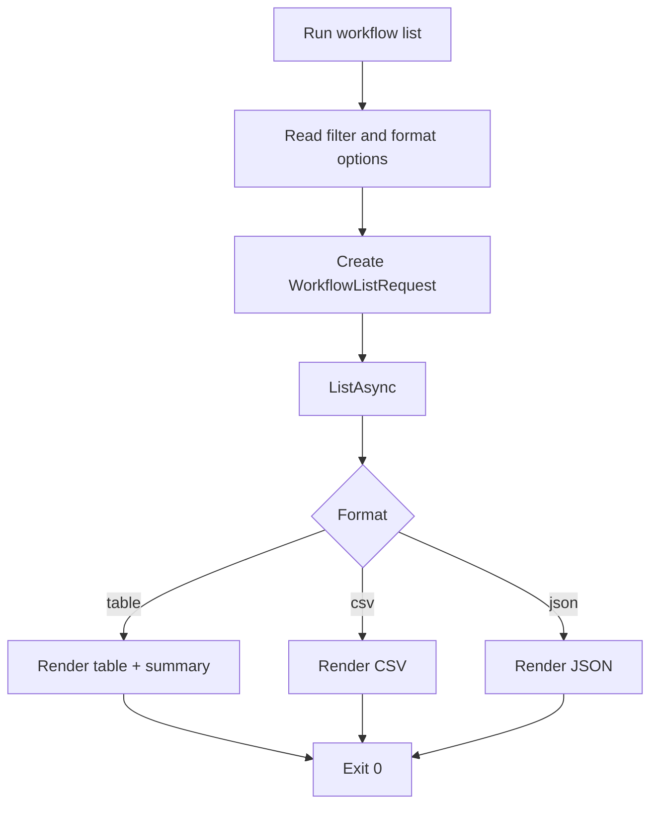

# UF-US-CLI-003: Workflow Listing and Filtering

- Story reference: US-CLI-003
- FR reference: FR-005
- Status: Backfilled from implementation
- Last updated: 2026-06-29

## Goal
Allow users to list and filter workflows in a predictable format that can be easily reviewed or used in automation.

## Primary Flow
1. User runs `workflow list` with optional `--filter` and `--format`.
2. The system applies the filter to retrieve matching workflows.
3. Results are returned based on the filter criteria.
4. The system displays results in the selected format:
   - `table`: formatted columns and summary count.
   - `csv`: CSV header and rows.
   - `json`: structured JSON output.
5. Command exits successfully.

## Alternate and Exception Flows

### A1: Empty Results
1. Filter returns no workflow rows.
2. CLI still renders valid empty output shape and summary.
3. CLI exits `0`.

### A2: Backend or Service Failure
- The request fails due to connection or system issues
- CLI displays a clear error message
- Command exits with failure

## Postconditions
- Operator gets a deterministic workflow list in requested format.
- Filtered output can be consumed by users or downstream scripts.

## Acceptance Mapping
- AC1: `workflow list` supports filter input.
  - Covered by Primary Flow steps 1-2.
- AC2: Output supports table, csv, and json formats.
  - Covered by Primary Flow step 4.
- AC3: Filtered results exclude non-matching items.
  - Covered by Primary Flow steps 2-3.

## Flow Diagram

## User Experience Notes
- Output formats should be consistent across all commands
- Empty results should still return valid output structures
- JSON and CSV outputs should be reliable for scripting and automation
``