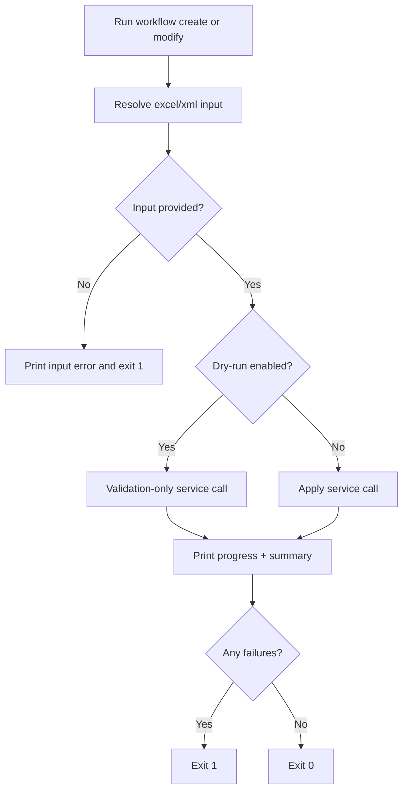

# UF-US-CLI-004: Workflow Change Execution with Dry-Run

- Story reference: US-CLI-004
- FR reference: FR-006
- Status: Backfilled from implementation
- Last updated: 2026-07-02

## Goal
Allow users to create or update workflows from a file, with the option to preview results before applying changes.

## Proposed Revision
- Planned CLI safety addition: [UF-US-CLI-004a-Workflow-Change-Review-and-Confirm.md](UF-US-CLI-004a-Workflow-Change-Review-and-Confirm.md)
- Proposed behavior: keep preview as an explicit `--dry-run` invocation, and add an interactive confirmation step before mutating create or modify execution.
- The primary flow below reflects current implementation; the proposal document captures the requested future-state CLI interaction.

## User Flow (Primary)

1. User runs `workflow create` or `workflow modify`.
2. User provides an input file (`--excel` or `--xml`).
3. The system validates the input file.
4. The system indicates whether the operation is a dry-run or will apply changes.
5. The system processes each item and displays progress.
6. The system displays a summary of results (total, succeeded, failed, skipped).
7. The command exits successfully if no failures occurred; otherwise, it exits with failure.

## Primary Flow
1. User runs `workflow create` or `workflow modify`.
2. User provides either `--excel` or `--xml` input.
3. CLI resolves input file path.
4. CLI prints operation banner (`DRY RUN` or apply mode).
5. CLI invokes service call:
   - `CreateAsync` for create command.
   - `ModifyAsync` for modify command.
6. CLI receives progress events and prints row-level status logs.
7. CLI prints summary totals (total/succeeded/failed/skipped).
8. CLI exits `0` when failed count is zero, otherwise exits `1`.

## Alternate and Exception Flows

### A1: Missing Input File
- User does not provide `--excel` or `--xml`
- CLI displays a clear error indicating a required input file
- Command exits with failure

### A2: Dry-Run Mode
- User specifies `--dry-run`
- The system validates and processes the input without making changes
- Progress and summary are still displayed

## Postconditions
- Change request is executed or validated according to command and dry-run mode.
- Operator receives per-item progress and final summary.

## Acceptance Mapping
- AC1: `workflow create` accepts Excel or XML input.
  - Covered by Primary Flow steps 1-3.
- AC2: `workflow modify` accepts Excel or XML input.
  - Covered by Primary Flow steps 1-3.
- AC3: `--dry-run` validates without mutating workflows.
  - Covered by A2.

## Flow Diagram

## User Experience Notes
- Dry-run mode should clearly indicate that no changes are applied
- Output should make it easy to distinguish between preview and actual execution
- Errors should be tied to specific items when possible
- Summary counts should match the detailed output for traceability
- If the proposal is implemented, interactive mutating create/modify runs should confirm intent before execution while preserving a non-interactive bypass for automation.