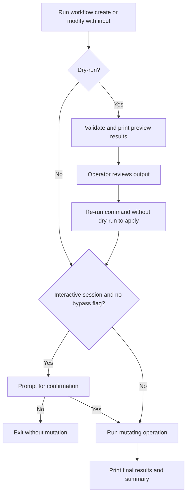

# UF-US-CLI-004a: Workflow Change Review and Confirm

- Story reference: US-CLI-004
- FR reference: Proposed refinement to FR-006
- Surface: CLI
- Status: Proposed
- Last updated: 2026-07-02

## Goal
Add a stronger operator-safety pattern for CLI workflow create and modify commands while preserving explicit dry-run behavior and automation-friendly execution.

## Scope
- Applies to `workflow create`
- Applies to `workflow modify`
- Keeps `--dry-run` as a separate explicit preview invocation
- Adds interactive confirmation for mutating runs in operator-driven sessions
- Preserves a non-interactive bypass such as `--yes` or `--force` for scripts and automation
- Does not change delete, which already has preview and confirmation behavior

## Problem Statement
The current CLI supports dry-run and mutating execution as separate modes, but mutating `workflow create` and `workflow modify` commands do not require confirmation. Operators may want a safer interactive path that mirrors delete behavior without forcing stateful two-stage command execution onto automation scenarios.

## Proposed Interaction Model
- Preview remains an explicit command invocation using `--dry-run`.
- Mutating create or modify execution remains a separate command invocation without `--dry-run`.
- In interactive sessions, mutating create or modify commands prompt for confirmation before server mutation begins.
- In automated or non-interactive scenarios, a bypass flag such as `--yes` or `--force` skips the prompt.
- The CLI should not automatically run dry-run first and then continue into apply within the same invocation.

## Proposed User Flow
1. User runs `workflow create` or `workflow modify` with an input file and `--dry-run`.
2. CLI validates the input and prints read-only preview results.
3. User reviews the output.
4. User reruns the same command without `--dry-run` to perform the write operation.
5. In an interactive session, the CLI prompts for confirmation before mutation.
6. If confirmed, the CLI runs the mutating operation.
7. The CLI prints final per-item results and summary totals.

## Alternate Flows

### A1: Operator Reviews but Does Not Apply
1. User runs `workflow create --dry-run` or `workflow modify --dry-run`.
2. CLI prints preview results.
3. User does not rerun the mutating command.
4. No server mutation occurs.

### A2: Interactive Confirmation Declined
1. User runs a mutating create or modify command in an interactive session.
2. CLI prompts for confirmation.
3. User declines.
4. Command exits without server mutation.

### A3: Automation or CI Execution
1. Script runs a mutating create or modify command with `--yes` or `--force`.
2. CLI skips the confirmation prompt.
3. CLI executes the mutating operation directly.

### A4: Missing Input File
1. User omits `--excel` and `--xml`.
2. CLI reports a required-input error.
3. Command exits with failure.

## Postconditions
- Operators have a clear preview-first path for review before mutation.
- Interactive write operations require an explicit confirmation step.
- Automation continues to work without prompt blocking when a bypass flag is supplied.

## Acceptance Intent
- The CLI shall continue to support explicit dry-run preview for create and modify workflow commands.
- The CLI shall prompt for confirmation before mutating create or modify execution in interactive sessions.
- The CLI shall support a bypass option for scripted or non-interactive execution.
- The CLI shall not implicitly chain dry-run and apply behavior into one invocation.

## Flow Diagram

## Documentation Notes
- This document is design-level and forward-looking.
- Do not update the implementation-baseline FR document until the behavior exists in code.
- When implemented, update FR-006 and the current CLI workflow-change flow to reflect the new default operator safety behavior.