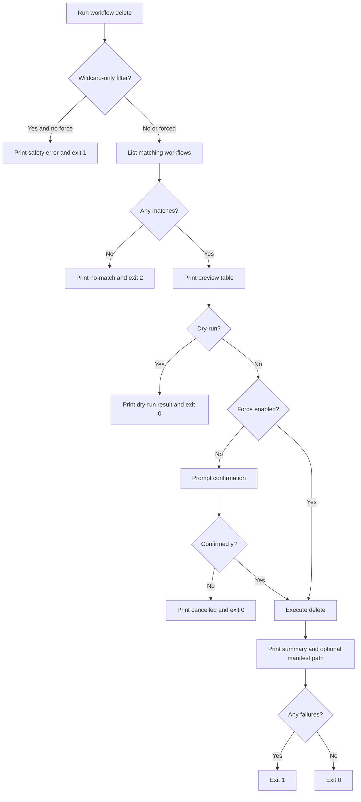

# UF-US-CLI-005: Safe Workflow Deletion

- Story reference: US-CLI-005
- FR references: FR-007, FR-029, FR-030
- Status: Backfilled from implementation
- Last updated: 2026-06-29

## Goal
Allow users to safely delete workflows by previewing results, enforcing safeguards, and requiring confirmation for high-risk operations.
``

## User Flow (Primary)

1. User runs `workflow delete` with a filter and optional safety options.
2. The system checks for risky filters (e.g., wildcard-only) and requires `--force` when necessary.
3. The system displays a list of workflows that match the filter.
4. The system shows a preview of items to be deleted along with warnings.
5. If `--dry-run` is specified, the command exits after preview with no changes.
6. If not in dry-run mode:
   - If `--force` is not used, the user is prompted for confirmation
7. Upon confirmation (or when forced), the system proceeds with deletion.
8. The system displays a summary of results and optional manifest output.
9. The command exits successfully if no failures occurred; otherwise, it exits with failure.

## Primary Flow
1. User runs `workflow delete` with required `--filter` and optional safety/options.
2. CLI enforces wildcard safety guard (`*`/`**` requires `--force`).
3. CLI lists candidate workflows before deletion.
4. CLI prints pre-delete preview table and in-process warning summary.
5. If `--dry-run` is set, CLI stops after preview and exits `0`.
6. If not dry-run and not force, CLI prompts for interactive confirmation.
7. On confirmation, CLI executes delete request with supplied status/manifest options.
8. CLI prints deletion summary and optional manifest file path.
9. CLI exits `0` when failed count is zero, otherwise exits `1`.

## Alternate and Exception Flows

### A1: Unsafe Wildcard Filter
- User provides a wildcard-only filter without `--force`
- CLI rejects the request with a safety error
- Command exits with failure

### A2: No Matching Workflows
1. Pre-list returns zero matches.
2. CLI prints no-match message.
3. CLI exits `2`.

### A3: Confirmation Declined
1. CLI prompts user for delete confirmation.
2. User does not confirm with `y`.
3. CLI prints cancelled message.
4. CLI exits `0` without mutation.

## Postconditions
- Delete operation is either safely previewed, cancelled, or executed with audit-friendly output.
- Optional manifest path is surfaced when requested.

## Acceptance Mapping
- AC1: Delete supports filter, status, dry-run, force, and manifest.
  - Covered by Primary Flow steps 1 and 7-8.
- AC2: Broad wildcard delete requires explicit force.
  - Covered by A1.
- AC3: Dry-run and manifest provide pre-delete visibility.
  - Covered by Primary Flow steps 4-5 and 8.

## Flow Diagram

## User Experience Notes
- High-risk operations should always provide a preview before execution
- Dangerous actions must require explicit user intent (`--force` or confirmation)
- Output should clearly differentiate between preview and execution
- Summary results should match the previewed items where possible
- Manifest output should support audit and traceability