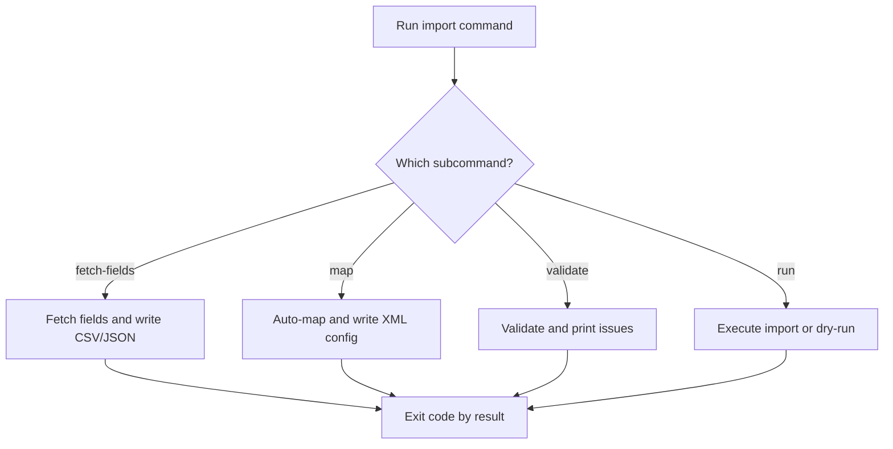

# UF-US-CLI-006: Import Pipeline Commands

- Story reference: US-CLI-006
- FR reference: FR-008
- Status: Backfilled from implementation
- Last updated: 2026-06-29

## Goal
Provide a complete non-interactive import pipeline through discrete commands for field discovery, mapping, validation, and execution.

## User Flow (Primary)

1. User selects an import command (`fetch-fields`, `map`, `validate`, or `run`).
2. The system validates required inputs for the selected command.
3. The selected command performs its operation:
   - Fetch fields for reference
   - Generate or apply mappings
   - Validate input data
   - Execute the import (or dry-run)
4. The system displays results or errors based on the command.
5. The command exits with a status code indicating success or failure.

## Alternate and Exception Flows

### A1: Missing Required Arguments
1. Required command options are not provided.
2. Parser rejects invocation and command does not execute normal handler path.
3. CLI exits non-zero.

### A2: Validation Failures
1. `import validate` returns invalid result.
2. CLI prints error list and warning list.
3. CLI exits `1`.

### A3: Runtime Errors During Run
1. `import run` returns service errors collection.
2. CLI prints errors.
3. CLI exits `2`.

### A4: Run Cancelled
1. Operator cancels execution during `import run`.
2. CLI prints cancellation message.
3. CLI exits `0`.

## Postconditions
- Operators can perform the full import lifecycle without client UI.
- Outputs and exit codes support automation usage.

## Acceptance Mapping
- AC1: Import group supports fetch-fields, map, validate, and run commands.
  - Covered by Primary Flow step 1.
- AC2: Each command validates required arguments.
  - Covered by Primary Flow step 2 and A1.
- AC3: Failures return non-zero status with error output.
  - Covered by A2 and A3.

## Flow Diagram

