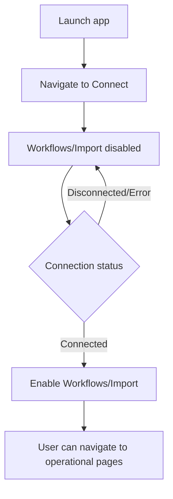

# UF-US-CONN-01: Connect-First Navigation Gating

- Story reference: US-CONN-01
- FR reference: FR-009
- Surface: GUI (Client)
- Status: Backfilled from implementation
- Last updated: 2026-06-29

## Goal
Ensure users connect before accessing operational features, preventing invalid actions and guiding them through the correct workflow.

## User Flow (Primary)
1. User launches the application.
2. The application opens on the Connect page.
3. Workflow and Import navigation options are disabled.
4. User successfully connects to the system.
5. The application updates to reflect a connected state.
6. Workflow and Import navigation options become available.
7. User can navigate to operational pages.

## Alternate Flows

### A1: Connection Lost or Fails
- Connection transitions to Disconnected or Error state
- Workflow and Import options are disabled
- User remains on or is guided back to the Connect experience

## Postconditions
- Unauthenticated users cannot access operational pages.
- Authenticated users can access workflow/import pages immediately after connect.

## Acceptance Mapping
- Application opens on Connect: Primary Flow steps 1-2.
- Workflow/Import unavailable until connected: steps 3 and A1.
- Pages become available after successful connect: steps 4-6.
- Connection state is reflected in behavior: steps 5-6 and A1.

## Flow Diagram

## User Experience Notes
- Users should never be able to access operational features without a valid connection
- Navigation state should clearly reflect connection status at all times
- Transitions between connected and disconnected states should be immediate and visible
- The Connect page should act as the primary entry point for all workflows