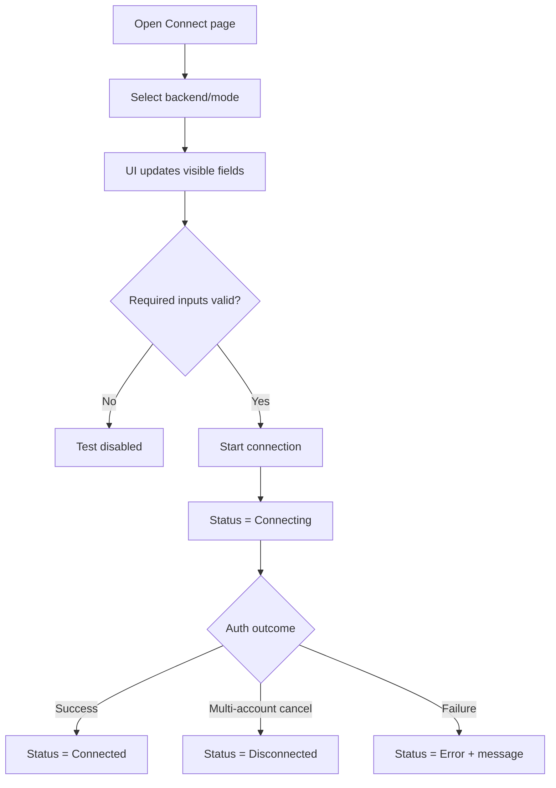

# UF-US-CONN-02 and UF-US-CONN-03: Connection Options and Status Feedback

- Story references: US-CONN-02, US-CONN-03
- FR references: FR-010, FR-011
- Surface: GUI (Client)
- Status: Backfilled from implementation
- Last updated: 2026-06-29

## Goal
Allow users to select how they connect and clearly understand connection status through adaptive inputs and real-time feedback.

## User Flow (Primary)
1. User opens the Connect page.
2. User selects a connection type (HTTP or COM) and may enable mock mode.
3. The interface updates to show only the relevant input fields.
4. User enters required connection details.
5. When inputs are valid, the user starts the connection.
6. The system shows a "Connecting" status.
7. If successful, the system updates to "Connected" and displays user/server details

## Alternate Flows

### A1: Validation Prevents Start
1. Required inputs for selected mode are missing.
2. Test action remains unavailable until valid inputs exist.

### A2: Connection Failure
- Connection attempt fails
- Status updates to "Error"
- A clear and actionable error message is displayed

### A3: User Selection Cancel Path
1. Multi-account dialog is presented.
2. User cancels selection.
3. Status returns to Disconnected with "Not connected".

## Postconditions
- Input controls remain mode-aware.
- Status and error feedback are visible and actionable throughout connection attempts.

## Acceptance Mapping
- Choose connection method and see relevant fields: Primary Flow steps 2-3.
- Required fields are enforced through command availability: A1.
- States Disconnected/Connecting/Connected/Error are shown: steps 5-6 and A2/A3.
- Failure presents clear explanation: A2.

## Flow Diagram

## User Experience Notes
- Only relevant inputs should be visible for the selected connection type
- The connection action should only be enabled when inputs are valid
- Status changes should be immediate and clearly visible
- Error messages should help users understand how to correct the issue
- Connected state should clearly display who is connected and to which server