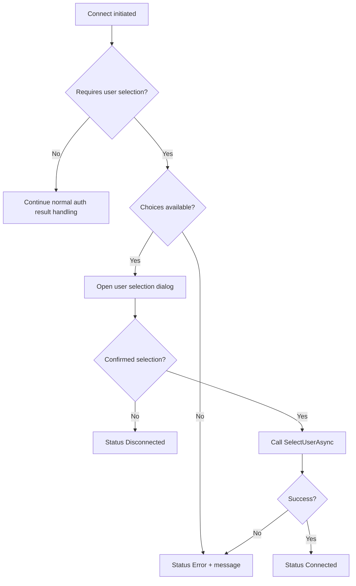

# UF-US-CONN-04: Multi-Account Selection in Connect Flow

- Story reference: US-CONN-04
- FR reference: FR-012
- Surface: GUI (Client)
- Status: Backfilled from implementation
- Last updated: 2026-06-29

## Goal
Allow users to select the correct account during sign-in when multiple accounts are available, without restarting the login process.

## User Flow (Primary)
1. User initiates connection.
2. The system determines that multiple accounts are available.
3. A selection dialog is presented with available account choices.
4. User selects an account and confirms.
5. The system completes login using the selected account.
6. On success, the system transitions to Connected and displays the selected identity.

## Alternate Flows

### A1: No Selectable Users Returned
- The system requires account selection but no choices are provided
- Status transitions to Error
- A clear message is displayed indicating the issue

### A2: User Cancels Dialog
1. User closes/cancels dialog without confirming selection.
2. Client sets Disconnected status and does not proceed.

### A3: Selection Completion Failure
1. `SelectUserAsync` fails.
2. Client sets Error status and displays error text.

## Postconditions
- Selected account identity is applied on success.
- Cancel/failure paths leave user in a safe disconnected/error state.

## Flow Diagram

## User Experience Notes
- The selection dialog should clearly identify each account to avoid confusion
- The user should not need to restart login after making a selection
- Canceling selection should always leave the system in a safe disconnected state
- Errors should clearly explain next steps when selection fails