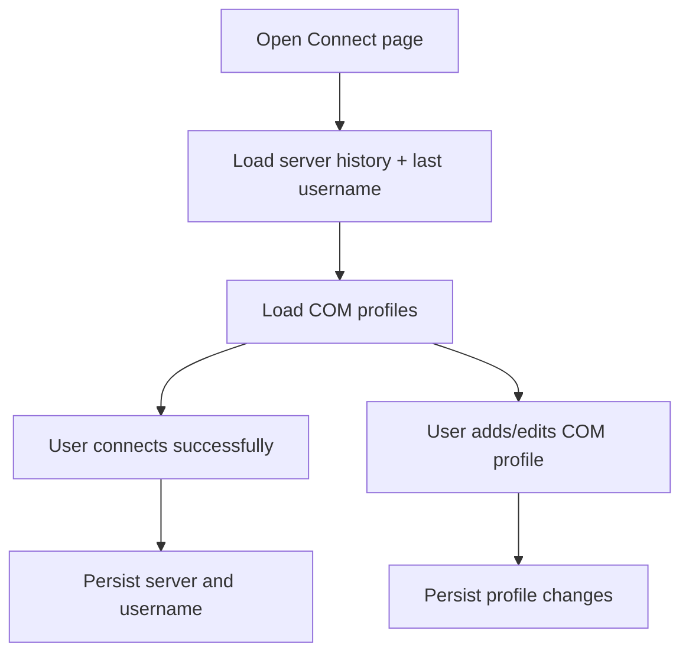

# UF-US-CONN-05 and UF-US-CONN-06: Connection Persistence and Profile Management

- Story references: US-CONN-05, US-CONN-06
- FR references: FR-013, FR-014
- Surface: GUI (Client)
- Status: Backfilled from implementation
- Last updated: 2026-06-29

## Goal
Help users reconnect quickly by remembering previous connection details and allowing reusable connection profiles.

## User Flow (Primary)
1. User opens the Connect page.
2. Previously used server and username values are shown.
3. Available connection profiles (if any) are displayed and can be selected.
4. User selects a profile or enters connection details.
5. User connects successfully.
6. The system remembers the connection details for future use.

## Secondary Flow: Manage Connection Profiles
1. User opens the profile management dialog.
2. User adds, edits, or removes a connection profile.
3. Updated profiles are saved.
4. Profiles are available for selection on the Connect page.

## Alternate Flows

### A1: No Saved History or Profiles
1. No prior persisted files exist.
2. Connect inputs and profile list start empty.

### A2: Persistence Read Errors
- Stored connection data is unavailable or corrupted
- The system falls back to empty inputs
- User can still proceed without interruption

## Postconditions
- Frequent users reconnect faster from saved values.
- COM environments can be managed through reusable profile definitions.

## Flow Diagram

## User Experience Notes
- Previously used values should be clearly distinguishable from manual input
- Users should be able to quickly select or modify saved entries
- Profile names should be meaningful to help users identify environments
- Persistence failures should never block connection attempts