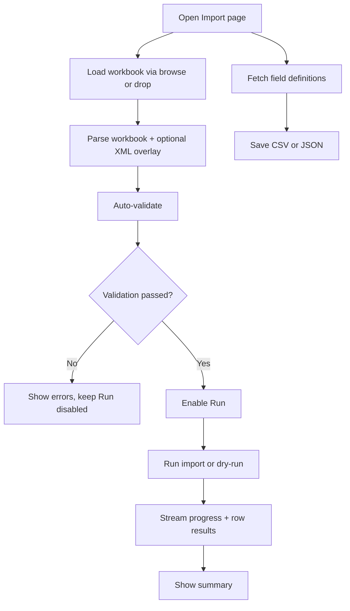

# UF-US-IMP-007: Client Import Operations

- Story reference: US-IMP-007
- FR reference: FR-038
- Surface: GUI (Client)
- Status: Backfilled from implementation
- Last updated: 2026-06-29

## Goal
Allow users to upload, validate, and execute imports through a guided interface with clear feedback and control.

## User Flow (Primary)

1. User opens the Import page.
2. User loads a workbook (via browse or drag-and-drop).
3. The system processes the file and displays a summary of data and mappings.
4. The system validates the input and updates validation status.
5. If valid, the user can run the import (or dry-run).
6. During execution, progress and row-level results are displayed.
7. The system displays a final summary of results.
8. User can optionally export field definitions for reference.

## Alternate Flows

### A1: Unsupported Drag-Dropped File
1. User drops a non-xlsx file.
2. Client shows unsupported file message and ignores drop.

### A2: Validation Errors
- Validation detects issues in the input
- Errors are displayed to the user
- The Run action remains disabled until issues are resolved

### A3: Import Cancelled
- User cancels an active import
- The system stops processing safely
- Partial results and cancellation status are displayed

## Postconditions
- Import path is guided and observable end-to-end.
- Validation gating prevents accidental execution on invalid inputs.

## Flow Diagram

## User Experience Notes
- Validation status should be clearly visible before execution
- Users should understand why the Run action is enabled or disabled
- Progress feedback should update continuously for long-running operations
- Results and summaries should align with the data shown during execution
- Cancel actions should always leave the system in a consistent state