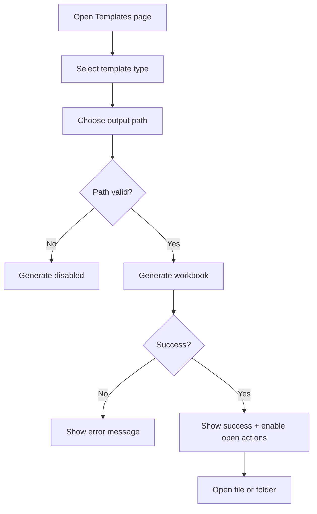

# UF-US-IMP-008: Client Template Generation

- Story reference: US-IMP-008
- FR reference: FR-039
- Surface: GUI (Client)
- Status: Backfilled from implementation
- Last updated: 2026-06-29

## Goal
Allow users to quickly generate and access ready-to-use templates for imports and workflows.

## User Flow (Primary)
1. User opens the Templates page.
2. User selects a template type (Data Import or Workflow).
3. User chooses an output location.
4. User starts template generation.
5. The system creates and saves the template file.
6. The system confirms success and provides options to open the file or its location.
7. User opens the generated file or containing folder.

## Alternate Flows

### A1: Invalid Output Path
1. Output path is missing.
2. Generate action remains unavailable.

### A2: Generation Failure
- Template generation fails due to a file or system error
- The system displays a clear error message
- No file is created or marked as successful

## Postconditions
- User receives a correctly structured starter template for selected operation domain.
- Generated artifact is discoverable immediately through open actions.

## Flow Diagram

## User Experience Notes
- Template generation should be fast and responsive
- Users should immediately understand where the file was saved
- Open actions should be easily accessible after generation
- Generated templates should always follow the correct structure and format
- File naming should help users identify the template type