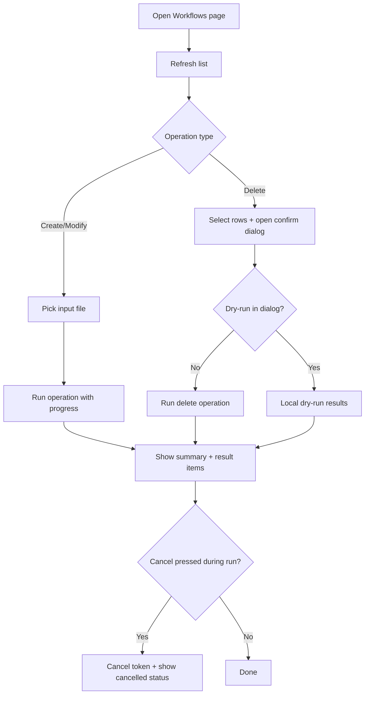

# UF-US-WF-006: Client Workflow Operations

- Story reference: US-WF-006
- FR reference: FR-031
- Surface: GUI (Client)
- Status: Backfilled from implementation
- Last updated: 2026-06-29

## Goal
Allow users to view, create, update, and delete workflows through a guided interface with validation, preview, and clear feedback.

## User Flow (Primary)
1. User navigates to the Workflows page after connecting.
2. The system displays the current list of workflows and allows filtering.
3. User selects an operation:
   - Create or modify using an input file
   - Delete selected workflows
4. For create/modify:
   - User selects a file and optionally enables dry-run
5. For delete:
   - User selects workflows and confirms the action in a dialog
6. The system processes the operation and displays progress and per-item results.
7. The system displays a summary of outcomes.
8. User can copy or clear results for further use.

## Alternate Flows

### A1: Delete with No Eligible Items
1. Selected items are all skipped by eligibility checks.
2. Client reports "No workflows eligible for deletion" without mutation.

### A2: Operation Cancelled
1. User clicks cancel during active operation.
2. Client cancels token, records cancellation result, and updates progress text.

### A3: Operation Failure
- Errors occur during the operation
- Failed items are displayed with details
- The system shows a completion summary with failures

## Postconditions
- User gets transparent progress and per-item outcomes.
- Mutating operations support safer dry-run and confirm-first behavior.

## Flow Diagram

## User Experience Notes
- Users should clearly understand whether they are in dry-run or execution mode
- Progress feedback should update continuously for long-running operations
- Results should be easy to review, copy, or clear
- Destructive actions (delete) should always require confirmation
- Filtering should help users quickly find relevant workflows