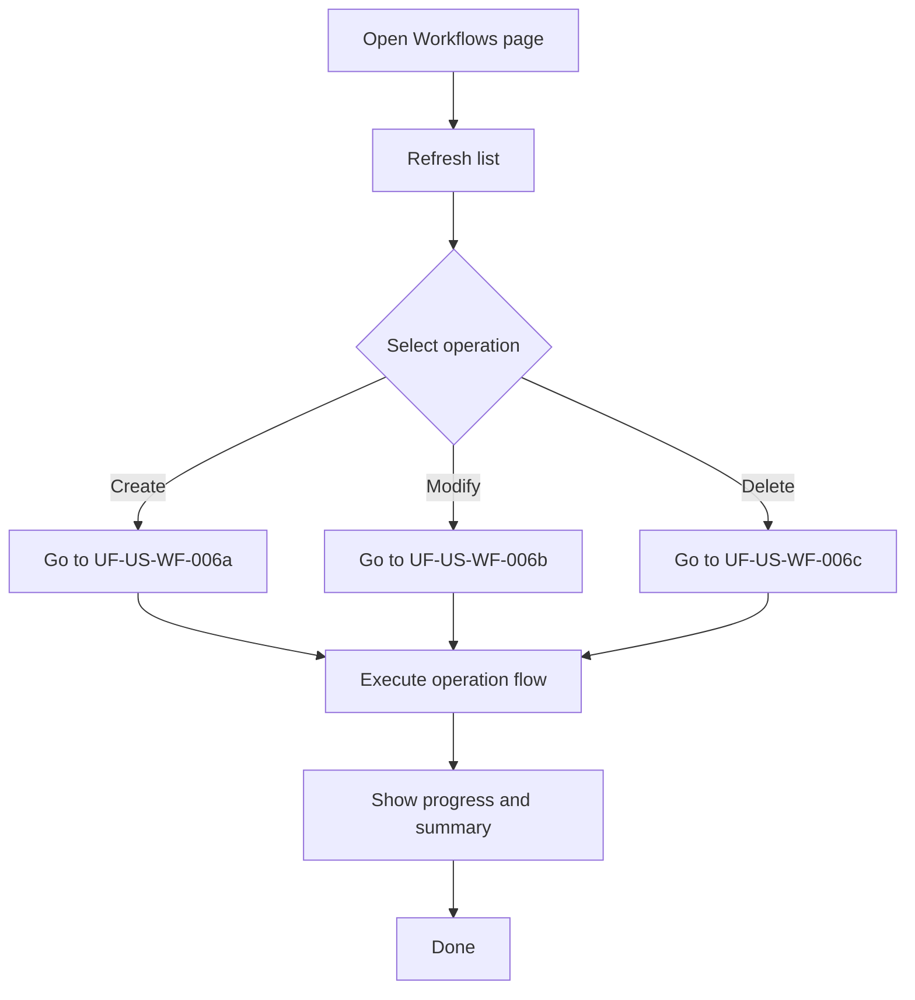

# UF-US-WF-006: Client Workflow Operations (Overview)

- Story reference: US-WF-006
- FR reference: FR-031
- Surface: GUI (Client)
- Status: Backfilled from implementation
- Last updated: 2026-07-02

## Goal
Provide a single landing page for client workflow operations while delegating Create, Modify, and Delete behavior to dedicated user-flow documents.

## Operation-Specific User Flows
- Create: [UF-US-WF-006a-Client-Workflow-Create.md](UF-US-WF-006a-Client-Workflow-Create.md)
- Modify: [UF-US-WF-006b-Client-Workflow-Modify.md](UF-US-WF-006b-Client-Workflow-Modify.md)
- Delete: [UF-US-WF-006c-Client-Workflow-Delete.md](UF-US-WF-006c-Client-Workflow-Delete.md)

## Proposed UX Revision
- Review-before-apply for Create and Modify: [UF-US-WF-006d-Client-Workflow-Review-Before-Apply.md](UF-US-WF-006d-Client-Workflow-Review-Before-Apply.md)
- This proposal adds a read-only preview results step before any mutating Create or Modify execution is enabled.

## Summary Flow
1. User navigates to the Workflows page after connecting.
2. The system displays workflow list and filtering controls.
3. User selects one operation: Create, Modify, or Delete.
4. Client executes the selected operation-specific flow.
5. Client displays progress, per-item messages, and completion summary.
6. User can copy or clear results.

## Shared Alternate Behaviors
- Operation cancelled: user can cancel an active run; client records cancellation and updates progress text.
- Operation failure: failed items include details and are surfaced in the completion summary.

## Postconditions
- Users can locate operation-specific behavior in dedicated user-flow documents.
- Users get transparent progress and per-item outcomes across all workflow operations.

## Flow Diagram

## User Experience Notes
- Keep operation entry points explicit so users do not confuse Create, Modify, and Delete paths.
- Progress feedback should update continuously for long-running operations.
- Results should be easy to review, copy, or clear.
- Destructive actions (delete) should always require confirmation.
- Mutating create and modify actions may benefit from the same explicit review-before-apply pattern already used by delete confirmation.