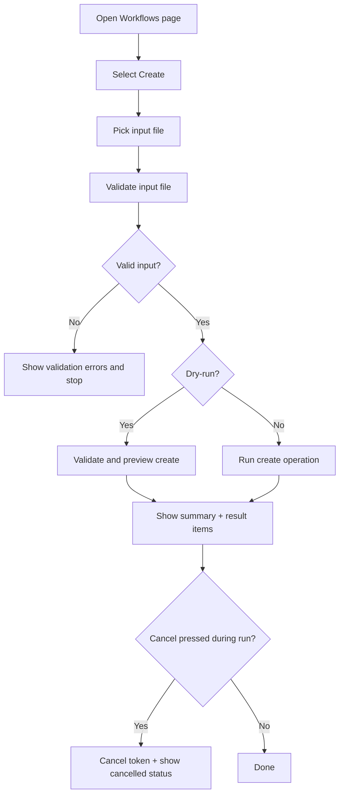

# UF-US-WF-006a: Client Workflow Create

- Story reference: US-WF-006
- FR reference: FR-031
- Surface: GUI (Client)
- Status: Backfilled from implementation
- Last updated: 2026-06-30

## Goal
Allow users to create workflows from input files with optional dry-run, progress visibility, and clear per-item outcomes.

## User Flow (Primary)
1. User navigates to the Workflows page after connecting.
2. User selects Create.
3. User selects an input file.
4. User optionally enables dry-run mode.
5. The system validates the input file before operation start.
6. The system starts create processing and displays live progress.
7. The system shows per-item result messages as processing continues.
8. The system displays completion summary totals.
9. User can copy or clear results.

## Alternate Flows

### A1: Dry-Run Create
1. User enables dry-run before starting create.
2. Client validates and evaluates create input without mutation.
3. Client reports preview-style result messages and summary.

### A2: Invalid Input File
1. Input is missing or fails validation.
2. Client displays validation errors.
3. Operation does not start.

### A3: Operation Cancelled
1. User clicks cancel during active create run.
2. Client cancels token, records cancellation result, and updates progress text.

### A4: Operation Failure
- One or more items fail during create.
- Failed items are displayed with details.
- Completion summary includes failed count.

## Postconditions
- Workflows are created when not in dry-run and no blocking errors occur.
- User receives progress visibility and per-item create results.

## Flow Diagram

## User Experience Notes
- Create mode should be visually distinct from modify and delete.
- Dry-run must clearly indicate no server mutation.
- Progress and errors should remain readable for large batches.
