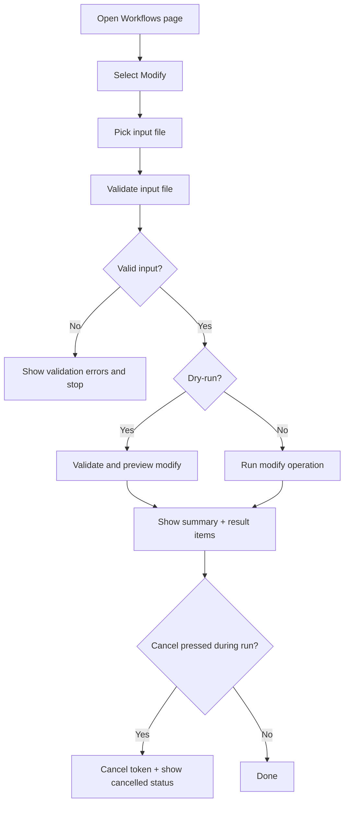

# UF-US-WF-006b: Client Workflow Modify

- Story reference: US-WF-006
- FR reference: FR-031
- Surface: GUI (Client)
- Status: Backfilled from implementation
- Last updated: 2026-07-02

## Goal
Allow users to modify existing workflows from input files with optional dry-run, progress visibility, and clear per-item outcomes.

## Proposed Revision
- Planned UX addition: [UF-US-WF-006d-Client-Workflow-Review-Before-Apply.md](UF-US-WF-006d-Client-Workflow-Review-Before-Apply.md)
- Proposed behavior: after file validation, the client runs a read-only preview and presents reviewable Operation Results before enabling a separate apply action.
- The primary flow below reflects current implementation; the proposal document captures the requested future-state interaction.

## User Flow (Primary)
1. User navigates to the Workflows page after connecting.
2. User selects Modify.
3. User selects an input file.
4. User optionally enables dry-run mode.
5. The system validates the input file before operation start.
6. The system starts modify processing and displays live progress.
7. The system shows per-item result messages as processing continues.
8. The system displays completion summary totals.
9. User can copy or clear results.

## Alternate Flows

### A1: Dry-Run Modify
1. User enables dry-run before starting modify.
2. Client validates and evaluates modify input without mutation.
3. Client reports preview-style result messages and summary.

### A2: Invalid Input File
1. Input is missing or fails validation.
2. Client displays validation errors.
3. Operation does not start.

### A3: Operation Cancelled
1. User clicks cancel during active modify run.
2. Client cancels token, records cancellation result, and updates progress text.

### A4: Operation Failure
- One or more items fail during modify.
- Failed items are displayed with details.
- Completion summary includes failed count.

## Postconditions
- Target workflows are modified when not in dry-run and no blocking errors occur.
- User receives progress visibility and per-item modify results.

## Flow Diagram

## User Experience Notes
- Modify mode should clearly indicate existing workflows may be changed.
- Dry-run must clearly indicate no server mutation.
- Progress and errors should remain readable for large batches.
- If the review-before-apply proposal is implemented, the apply action should remain disabled until preview results have completed and been reviewed.
