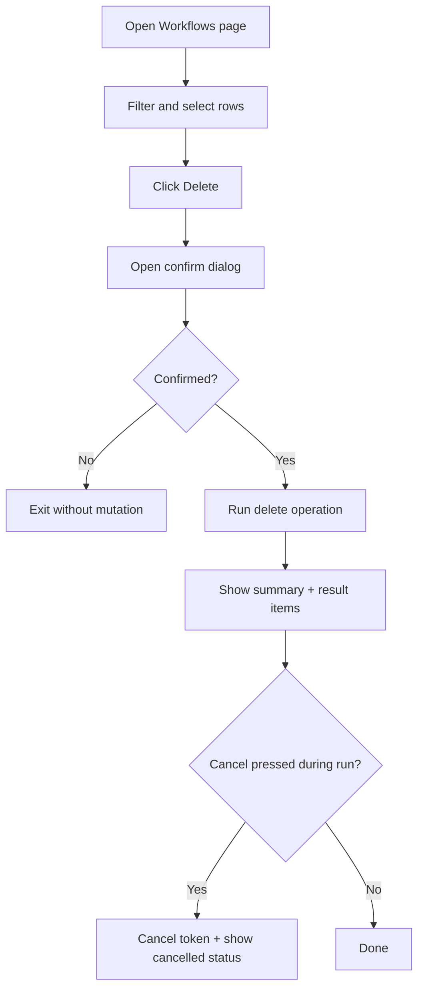

# UF-US-WF-006c: Client Workflow Delete

- Story reference: US-WF-006
- FR reference: FR-031
- Surface: GUI (Client)
- Status: Backfilled from implementation
- Last updated: 2026-06-30

## Goal
Allow users to delete selected workflows safely with explicit confirmation, progress visibility, and clear per-item outcomes.

## User Flow (Primary)
1. User navigates to the Workflows page after connecting.
2. User filters and selects one or more workflows.
3. User selects Delete.
4. Client shows confirmation dialog with selected scope.
5. User confirms deletion.
6. The system starts delete processing and displays live progress.
7. The system shows per-item result messages as processing continues.
8. The system displays completion summary totals.
9. User can copy or clear results.

## Alternate Flows

### A1: Delete with No Eligible Items
1. Selected items are all skipped by eligibility checks.
2. Client reports "No workflows eligible for deletion" without mutation.

### A2: Confirmation Declined
1. User opens delete confirmation.
2. User cancels or declines confirmation.
3. Delete operation does not start.

### A3: Operation Cancelled
1. User clicks cancel during active delete run.
2. Client cancels token, records cancellation result, and updates progress text.

### A4: Operation Failure
- One or more items fail during delete.
- Failed items are displayed with details.
- Completion summary includes failed count.

## Postconditions
- Selected eligible workflows are deleted after explicit confirmation.
- User receives progress visibility and per-item delete results.

## Flow Diagram

## User Experience Notes
- Delete should always require clear confirmation before execution.
- Selection scope should remain visible in the confirmation dialog.
- Progress and failure details should be easy to audit after completion.
