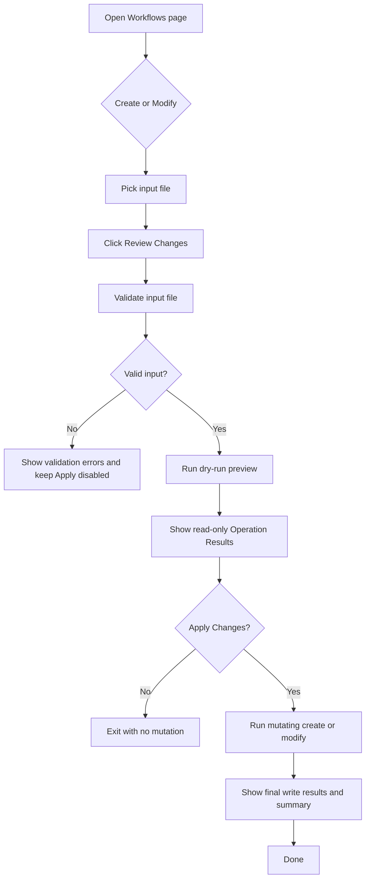

# UF-US-WF-006d: Client Workflow Review Before Apply

- Story reference: US-WF-006
- FR reference: Proposed refinement to FR-031
- Surface: GUI (Client)
- Status: Proposed
- Last updated: 2026-07-02

## Goal
Add a mandatory review step for mutating workflow Create and Modify operations so users see read-only Operation Results before they can apply changes.

## Scope
- Applies to Create from Excel
- Applies to Create from XML
- Applies to Modify from file
- Does not change Delete, which already has an explicit confirmation step
- Does not change CLI workflow behavior in this proposal

## Problem Statement
The current client flow allows Create and Modify to run directly in mutating mode or optional dry-run mode. Users may want a consistent, safer interaction in which the client always produces a preview first and only exposes the write action after results have been reviewed.

## Proposed User Flow
1. User navigates to the Workflows page after connecting.
2. User selects Create or Modify.
3. User selects an input file.
4. User selects Review Changes.
5. The client validates the input file.
6. The client runs a read-only preview using the existing dry-run behavior.
7. The client shows Operation Results and summary totals in a review state.
8. The client exposes an Apply Changes action only after preview completes.
9. User either applies the changes or returns to adjust the file/operation.
10. If the user applies changes, the client runs the mutating operation.
11. The client shows final Operation Results and completion summary for the write action.

## Interaction Model
- Review Changes is the first action for Create and Modify.
- Apply Changes is a separate action and is not shown or is disabled until preview succeeds or completes without blocking validation errors.
- Preview results must be visually labeled as read-only and non-mutating.
- Final apply results must be visually distinct from preview results.
- If the input file changes after preview, the prior preview is invalidated and Apply Changes becomes unavailable until review is rerun.

## Alternate Flows

### A1: Preview Validation Failure
1. User starts Review Changes.
2. Validation fails or input cannot be processed.
3. Client displays errors.
4. Apply Changes remains unavailable.

### A2: User Declines to Apply
1. Preview completes and results are shown.
2. User reviews the preview and does not proceed.
3. No server mutation occurs.

### A3: Preview Shows Mixed Outcomes
1. Preview completes with success, skip, or fail rows.
2. Client allows Apply Changes only when the remaining policy permits execution.
3. Blocking failures should force user correction before apply.

### A4: Apply Execution Cancelled
1. User starts Apply Changes.
2. User cancels during the mutating run.
3. Client cancels the active token, records cancellation result, and updates progress text.

### A5: Input Changed After Preview
1. User previews a file.
2. User changes mode, file, or relevant options.
3. Client clears or marks preview results stale.
4. User must rerun Review Changes before apply is available.

## Postconditions
- No create or modify mutation occurs until the user has seen a preview and explicitly chosen to apply changes.
- Users receive separate preview and apply result feedback.
- The launcher aligns create/modify safety behavior more closely with delete confirmation.

## Acceptance Intent
- The launcher shall require a read-only preview step before mutating Create or Modify execution is available.
- The launcher shall display preview results using the existing Operation Results surface with clear non-mutating labeling.
- The launcher shall provide a separate Apply Changes action after preview completion.
- The launcher shall invalidate prior preview approval when the selected file or execution options change.

## Flow Diagram

## Documentation Notes
- This document is design-level and forward-looking.
- Do not update the implementation-baseline FR document until the behavior exists in code.
- When implemented, update FR-031 and the current-flow documents for Create and Modify to reflect the new default interaction.